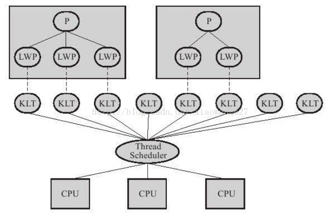
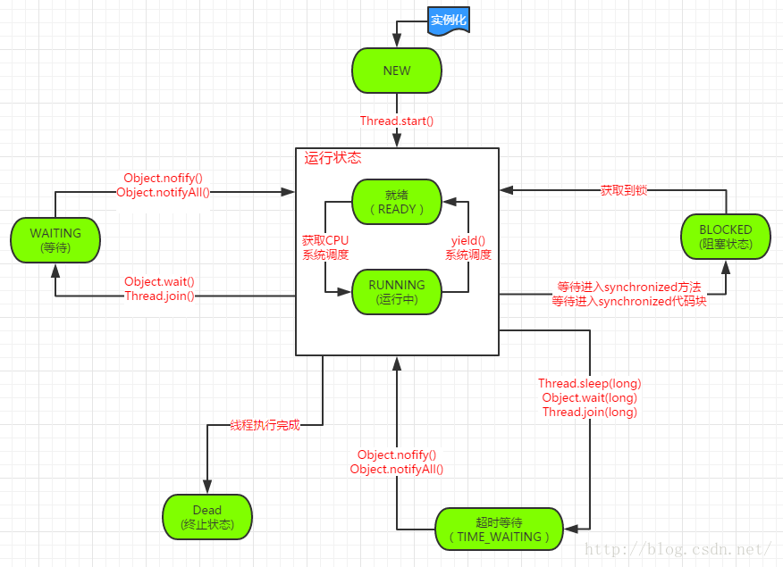

# java多线程-概念&创建启动&中断&守护线程&优先级&线程状态(多线程编程之一)
今天开始就来总结一下java多线程的基础知识点，下面是本篇的主要内容（大部分知识点参考java核心技术卷1）：

1.什么是线程以及多线程与进程的区别
2.多线程的创建与启动
3.中断线程和守护线程以及线程优先级
4.线程的状态转化关系
## 什么是线程以及多线程与进程的区别
在现代操作在运行一个程序时，会为其创建一个进程。例如启动一个QQ程序，操作系统就会为其创建一个进程。而操作系统中调度的最小单位元是线程，也叫轻量级进程，在一个进程里可以创建多个线程，这些线程都拥有各自的计数器，堆栈和局部变量等属性，并且能够访问共享的内存变量。处理器在这些线程上高速切换，让使用者感觉到这些线程在同时执行。因此我们可以这样理解：
进程：正在运行的程序，是系统进行资源分配和调用的独立单位。每一个进程都有它自己的内存空间和系统资源。
线程：是进程中的单个顺序控制流，是一条执行路径一个进程如果只有一条执行路径，则称为单线程程序。一个进程如果有多条执行路径，则称为多线程程序。
我们知道，线程是币进程更轻量级的调度执行单位，线程的引入，可以把一个进程的资分配和执行调度分开，各个线程既可以共享进程资源（内存地址、文件IO等），又可以独立调度，线程是CPU调度的基本单位。
主流的操作系统都提供了线程的实现，Java语言则提供了不同硬件和操作系统平台下对线程操作的统一处理，每个已经执行start()且未结束的java.lang.Thread类的实例就代表了一个线程。Thread的所有关键方法都是声明为nativede ，在JavaAPI中，一个native方法往往意味着这个方法没有使用或者无法使用平台无关的手段来实现，当然也有可能是为了执行效率而使用native方法。实现线程主要有3种方式：使用内核线程实现，使用用户线程实现和使用用户线程加轻量级进程混合实现。

* 使用内核线程实现：这种实现方式线程直接由操作系统内核支持。程序一般不会直接去使用内核线程，而是去使用内核线程的一种高级接口——轻量级进程，轻量级进程与内核线程之间是1:1的关系，称为一对一的线程模型 。

* 使用用户线程实现：用户线程完全建立在用户空间的线程库上，系统内核不能感知其存在。 用户线程的建立、 同步、 销毁和调度完全在用户态中完成，不需要内核的帮助。进程与用户线程为1：N的关系。Java早起曾采用该种实现，现已放弃。
* 使用用户线程加轻量级进程混合实现 这种实现方式将内核线程与用户线程一起使用，在这种混合实现下，既存在用户线程，也存在轻量级进程。 用户线程还是完全建立在用户空间中 。用户线程与轻量级进程为N:M的关系。

在JDK1.2以后的版本中，线程模型是基于操作系统原生线程模型来实现的，对于Sun JDK来说，它的Windows版与Linux版都是使用一对一的线程模型实现的，一条Java线程就映射到一条轻量级进程之中，因为Windows和Linux系统提供的线程模型就是一对一的。
## 多线程的创建与启动
创建多线程有两种方法，一种是继承Thread类重写run方法，另一种是实现Runnable接口重写run方法。下面我们分别给出代码示例，继承Thread类重写run方法：
```java
package com.zejian.test;
/**
 * @author zejian
 * @time 2016年3月11日 下午9:57:44
 * @decrition 继承Thread实现线程
 */
public class ThreadByEx extends Thread{
	/**
	 * 重写run方法
	 */
	@Override
	public void run() {
		System.out.println("I'm a thread that extends Thread!");
	}
}
```
实现Runnable接口重写run方法：
```java
package com.zejian.test;  
/** 
 * @author zejian 
 * @time 2016年3月11日 下午10:00:36 
 * @decrition 实现Runnable接口重写run方法 
 */  
public class ThreadByRunnable implements Runnable{  
    /** 
     * 实现run方法 
     */  
    @Override  
    public void run() {  
        System.out.println("I'm a thread that implements Runnable !");  
    }  
}  
```
怎么启动线程？
```java
package com.zejian.test;  
public class MainTest {  
      
    public static void main(String[] args) {  
        //继承Thread启动的方法  
        ThreadByEx t1=new ThreadByEx();  
        t1.start();//启动线程  
          
          
        //实现Runnable启动线程的方法  
        ThreadByRunnable r = new ThreadByRunnable();  
        Thread t2 =new Thread(r);  
        t2.start();//启动线程  
    }  
}
```
运行结果：
```text
I'm a thread that extends Thread!  
I'm a thread that implements Runnable !  
```
代码相当简单，不过多解释。这里有点需要注意的是调用start()方法后并不是是立即的执行多线程的代码，而是使该线程变为可运行态，什么时候运行多线程代码是由操作系统决定的。
## 中断线程和守护线程以及线程优先级
### 什么是中断线程？
我们来考虑一些场景。
* 比如我们会启动多个线程做同一件事，比如抢12306的火车票，我们可能开启多个线程从多个渠道买火车票，只要有一个渠道买到了，我们会通知取消其他渠道。这个时候需要关闭其他线程
* 很多线程的运行模式是死循环，比如在生产者/消费者模式中，消费者主体就是一个死循环，它不停的从队列中接受任务，执行任务，在停止程序时，我们需要一种”优雅”的方法以关闭该线程在一些场景中。
* 从第三方服务器查询一个结果，我们希望在限定的时间内得到结果，如果得不到，我们会希望取消该任务。
这个时候就需要中断这些线程。
我们先来看看中断线程是什么？(该解释来自java核心技术一书，我对其进行稍微简化)，当线程的run()方法执行方法体中的最后一条语句后，并经由执行return语句返回时，或者出现在方法中没有捕获的异常时线程将终止。在java早期版本中有一个stop方法，其他线程可以调用它终止线程，但是这个方法现在已经被弃用了，因为这个方法会造成一些线程不安全的问题。我们可以把中断理解为一个标识位的属性，它表示一个运行中的线程是否被其他线程进行了中断操作，而中断就好比其他线程对该线程打可个招呼，其他线程通过调用该线程的interrupt方法对其进行中断操作，当一个线程调用interrupt方法时，线程的中断状态（标识位）将被置位（改变），这是每个线程都具有的boolean标志，每个线程都应该不时的检查这个标志，来判断线程是否被中断。
但是如果此时线程处于阻塞状态（sleep或者wait），无法获取cpu执行时间，就无法检查中断状态，此时调用这个阻塞线程中断方法的线程就会抛出InterruptedException异常。

#### 废弃的API
Thread.STOP()之类的api会造成一些不可预知的bug，所以很早便Deprecated了，真要纠结为什么请看这边文章[《为何不赞成使用 Thread.stop、Thread.suspend 和 Thread.resume》](https://docs.oracle.com/javase/6/docs/technotes/guides/concurrency/threadPrimitiveDeprecation.html)
#### 线程中断API
|AIP|作用|
|---|---|
|public static boolean interrupted|就是返回对应线程的中断标志位是否为true，但它还有一个重要的副作用，就是清空中断标志位，也就是说，连续两次调用interrupted()，第一次返回的结果为true，第二次一般就是false (除非同时又发生了一次中断)。|
|public boolean isInterrupted()|就是返回对应线程的中断标志位是否为true|
|public void interrupt()|表示中断对应的线程|
#### 线程对中断的反应
* RUNNABLE：线程在运行或具备运行条件只是在等待操作系统调度
* WAITING/TIMED_WAITING：线程在等待某个条件或超时
* BLOCKED：线程在等待锁，试图进入同步块
* NEW/TERMINATED：线程还未启动或已结束
* IO操作：线程在等待输入输入流的完成，比如文件IO，网络IO等。

##### RUNNABLE状态
如果线程在运行中，interrupt()只是会设置线程的中断标志位，没有任何其它作用。线程应该在运行过程中合适的位置检查中断标志位，比如说，如果主体代码是一个循环，可以在循环开始处进行检查，如下所示：
```java
public class InterruptRunnableDemo extends Thread {
    @Override
    public void run() {
        while (!Thread.currentThread().isInterrupted()) {
            // ... 单次循环代码
        }
        System.out.println("done ");
    }
    public static void main(String[] args) throws InterruptedException {
        Thread thread = new InterruptRunnableDemo();
        thread.start();
        Thread.sleep(1000);
        thread.interrupt();
    }
}
```
##### WAITING/TIMED_WAITING
线程执行如下方法会进入WAITTING状态:
```java
public final void join() throws InterruptedException
public final void wait() throws InterruptedException
```
线程执行如下方法会进入TIMED_WAITING状态：
```java
public final native void wait(long timeout) throws InterruptedException;
public static native void sleep(long millis) throws InterruptedException;
public final synchronized void join(long millis) throws InterruptedException

```
在这些状态时，对线程对象调用interrupt()会使得该线程抛出InterruptedException，需要注意的是，抛出异常后，中断标志位会被清空(线程的中断标志位会由true重置为false，因为线程为了处理异常已经重新处于就绪状态。)，而不是被设置。比如说，执行如下代码：
```java
Thread t = new Thread (){
    @Override
    public void run() {
        try {
            Thread.sleep(1000);
        } catch (InterruptedException e) {
        //exception被捕获，但是为输出为false 因为标志位会被清空
            System.out.println(isInterrupted());
        }
    }        
};
t.start();
try {
    Thread.sleep(100);
} catch (InterruptedException e) {
}
t.interrupt();//置为true
```
#### 如何正确的取消、关闭线程
### 什么是守护线程？
首先我们可以通过t.setDaemon(true)的方法将线程转化为守护线程。而守护线程的唯一作用就是为其他线程提供服务。计时线程就是一个典型的例子，它定时地发送“计时器滴答”信号告诉其他线程去执行某项任务。当只剩下守护线程时，虚拟机就退出了，因为如果只剩下守护线程，程序就没有必要执行了。另外JVM的垃圾回收、内存管理等线程都是守护线程。还有就是在做数据库应用时候，使用的数据库连接池，连接池本身也包含着很多后台线程，监控连接个数、超时时间、状态等等。最后还有一点需要特别注意的是在java虚拟机退出时Daemon线程中的finally代码块并不一定会执行哦，代码示例：
```java
package com.zejian.test;  
/** 
 * @author zejian 
 * @time 2016年3月12日 上午10:42:19 
 * @decrition 守护线程代码示例 
 */  
public class Demon {  
    public static void main(String[] args) {  
        Thread deamon = new Thread(new DaemonRunner(),"DaemonRunner");  
        //设置为守护线程  
        deamon.setDaemon(true);  
        deamon.start();//启动线程  
    }  
      
      
    static class DaemonRunner implements Runnable{  
        @Override  
        public void run() {  
            try {  
                Thread.sleep(500);  
            } catch (InterruptedException e) {  
                e.printStackTrace();  
            }finally{  
                System.out.println("这里的代码在java虚拟机退出时并不一定会执行哦！");  
            }  
        }  
    }  
}  
```
因此在构建Daemon线程时，不能依靠finally代码块中的内容来确保执行关闭或清理资源的逻辑。
### 什么是线程优先级
在现代操作系统中基本采用时分的形式调度运行的线程，操作系统会分出一个个时间片，线程会分配到若干时间片，当线程的时间片用完了就会发生线程调度，并等待着下一次分配。线程分配到的时间片多少也决定了线程使用处理器资源的多少，而线程优先级就是决定线程需要多或者少分配一些处理器资源的线程属性。在java线程中，通过一个整型的成员变量Priority来控制线程优先级，每一个线程有一个优先级，默认情况下，一个线程继承它父类的优先级。可以用setPriority方法提高或降低任何一个线程优先级。可以将优先级设置在MIN_PRIORITY（在Thread类定义为1）与MAX_PRIORITY（在Thread类定义为10）之间的任何值。线程的默认优先级为NORM_PRIORITY（在Thread类定义为5）。尽量不要依赖优先级，如果确实要用，应该避免初学者常犯的一个错误。如果有几个高优先级的线程没有进入非活动状态，低优先级线程可能永远也不能执行。每当调度器决定运行一个新线程时，首先会在具有高优先级的线程中进行选择，尽管这样会使低优先级的线程可能永远不会被执行到。因此我们在设置优先级时，针对频繁阻塞（休眠或者I/O操作）的线程需要设置较高的优先级，而偏重计算（需要较多CPU时间或者运算）的线程则设置较低的优先级，这样才能确保处理器不会被长久独占。当然还有要注意就是在不同的JVM以及操作系统上线程的规划存在差异，有些操作系统甚至会忽略对线程优先级的设定，如mac os系统或者Ubuntu系统........
就是说不同的操作系统实现java线程优先级的方式不一样，不一定会严格按照设置的优先级别来确定线程的调度，所以不能依赖优先级的设定。
## 线程的状态转化关系
* 新建状态（New）：新创建了一个线程对象。
* 就绪状态（Runnable）：线程对象创建后，其他线程调用了该对象的start()方法。该状态的线程位于可运行线程池中，变得可运行，等待获取CPU的使用权。
* 运行状态（Running）：就绪状态的线程获取了CPU，执行程序代码。
* 阻塞状态（Blocked）：阻塞状态是线程因为某种原因放弃CPU使用权，暂时停止运行。直到线程进入就绪状态，才有机会转到运行状态。阻塞的情况分三种：
** 等待阻塞（WAITING）：运行的线程执行wait()方法，JVM会把该线程放入等待池中。
** 同步阻塞（Blocked）：运行的线程在获取对象的同步锁时，若该同步锁被别的线程占用，则JVM会把该线程放入锁池中。
** 超时阻塞（TIME_WAITING）：运行的线程执行sleep(long)或join(long)方法，或者发出了I/O请求时，JVM会把该线程置为阻塞状态。
* 死亡状态（Dead）：线程执行完了或者因异常退出了run()方法，该线程结束生命周期。
