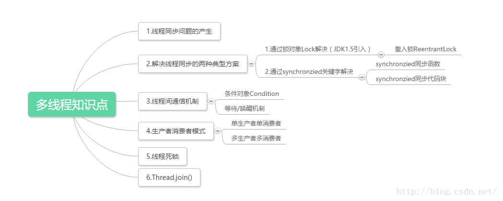

# java多线程同步以及线程间通信详解;消费者生产者模式;死锁;Thread.join()（多线程编程之二）
本篇我们将讨论以下知识点：

# 线程同步问题的产生
什么是线程同步问题，我们先来看一段卖票系统的代码，然后再分析这个问题：
```java
package com.zejian.test;  
/** 
 * @author zejian 
 * @time 2016年3月12日 下午2:55:42 
 * @decrition 模拟卖票线程 
 */  
public class Ticket implements Runnable  
{  
    //当前拥有的票数  
    private  int num = 100;  
    public void run()  
    {  
        while(true)  
        {  
                if(num>0)  
                {  
                    try{Thread.sleep(10);}catch (InterruptedException e){}  
                    //输出卖票信息  
                    System.out.println(Thread.currentThread().getName()+".....sale...."+num--);  
                }  
        }  
    }  
}  
```
上面是卖票线程类，下来再来看看执行类：
```java
package com.zejian.test;  
/**  
 * @author zejian  
 * @time 2016年3月12日 下午2:54:18  
 * @decrition 模拟卖票系统，该案例只考虑单方面卖票，其他情况暂时不考虑  
 */  
public class TicketDemo {  
      
    public static void main(String[] args)   
    {  
        Ticket t = new Ticket();//创建一个线程任务对象。  
          
        //创建4个线程同时卖票  
        Thread t1 = new Thread(t);  
        Thread t2 = new Thread(t);  
        Thread t3 = new Thread(t);  
        Thread t4 = new Thread(t);  
        //启动线程  
        t1.start();  
        t2.start();  
        t3.start();  
        t4.start();  
    }  
}  
```
运行程序结果如下（仅截取部分数据）：

从运行结果，我们就可以看出我们4个售票窗口同时卖出了1号票，这显然是不合逻辑的，其实这个问题就是我们前面所说的线程同步问题。不同的线程都对同一个数据进了操作这就容易导致数据错乱的问题，也就是线程不同步。那么这个问题该怎么解决呢？在给出解决思路之前我们先来分析一下这个问题是怎么产生的？我们声明一个线程类Ticket，在这个类中我们又声明了一个成员变量num也就是票的数量，然后我们通过run方法不断的去获取票数并输出，最后我们在外部类TicketDemo中创建了四个线程同时操作这个数据，运行后就出现我们刚才所说的线程同步问题，从这里我们可以看出产生线程同步(线程安全)问题的条件有两个：1.多个线程在操作共享的数据（num），2.操作共享数据的线程代码有多条（4条线程）；既然原因知道了，那该怎么解决？
解决思路：将多条操作共享数据的线程代码封装起来，当有线程在执行这些代码的时候，其他线程时不可以参与运算的。必须要当前线程把这些代码都执行完毕后，其他线程才可以参与运算。 好了，思路知道了，我们就用java代码的方式来解决这个问题。
## 解决线程同步的两种典型方案
在java中有两种机制可以防止线程安全的发生，Java语言提供了一个synchronized关键字来解决这问题，同时在Java SE5.0引入了Lock锁对象的相关类，接下来我们分别介绍这两种方法
### 通过锁（Lock）对象的方式解决线程安全问题
在给出解决代码前我们先来介绍一个知识点：Lock，锁对象。在java中锁是用来控制多个线程访问共享资源的方式，一般来说，一个锁能够防止多个线程同时访问共享资源（但有的锁可以允许多个线程并发访问共享资源，比如读写锁，后面我们会分析）。在Lock接口出现之前，java程序是靠synchronized关键字（后面分析）实现锁功能的，而JAVA SE5.0之后并发包中新增了Lock接口用来实现锁的功能，它提供了与synchronized关键字类似的同步功能，只是在使用时需要显式地获取和释放锁，缺点就是缺少像synchronized那样隐式获取释放锁的便捷性，但是却拥有了锁获取与释放的可操作性，可中断的获取锁以及超时获取锁等多种synchronized关键字所不具备的同步特性。接下来我们就来介绍Lock接口的主要API方便我们学习

| 水果        | 价格    |  数量  |
| --------   | -----:   | :----: |
| 香蕉        | $1      |   5    |
| 苹果        | $1      |   6    |
| 草莓        | $1      |   7    |

|方法	|相关描述内容			|
|----	|-------------------|
|void lock()|	获取锁，调用该方法当前线程会获取锁，当获取锁后。从该方法返回|
|void lockInterruptibly()throwsInterruptedException|可中断获取锁和lock()方法不同的是该方法会响应中断，即在获取锁中可以中断当前线程。例如某个线程在等待一个锁的控制权的这段时间需要中断。|
|boolean tryLock()|	尝试非阻塞获取锁，调用该方法后立即返回，如果能够获取锁则返回true，否则返回false。|
|boolean tryLock(long time,TimeUnit unit)throws  InterruptedException|	超时获取锁，当前线程在以下3种情况返回：
1.当前线程在超时时间内获取了锁
2.当前线程在超时时间被中断
3.当前线程超时时间结束，返回false|
|void unlock()	|释放锁|
|Condition newCondition()|条件对象，获取等待通知组件。该组件和当前的锁绑定，当前线程只有获取了锁，才能调用该组件的await()方法，而调用后，当前线程将缩放锁。|

这里先介绍一下API，后面我们将结合Lock接口的实现子类ReentrantLock使用某些方法。