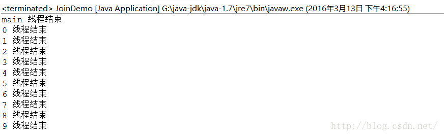

# java多线程同步以及线程间通信详解;消费者生产者模式;死锁;Thread.join()（多线程编程之二）
本篇我们将讨论以下知识点：

## java多线程同步以及线程间通信详解
### 线程同步问题的产生
什么是线程同步问题，我们先来看一段卖票系统的代码，然后再分析这个问题：
```java
package com.zejian.test;  
/** 
 * @author zejian 
 * @time 2016年3月12日 下午2:55:42 
 * @decrition 模拟卖票线程 
 */  
public class Ticket implements Runnable  
{  
    //当前拥有的票数  
    private  int num = 100;  
    public void run()  
    {  
        while(true)  
        {  
                if(num>0)  
                {  
                    try{Thread.sleep(10);}catch (InterruptedException e){}  
                    //输出卖票信息  
                    System.out.println(Thread.currentThread().getName()+".....sale...."+num--);  
                }  
        }  
    }  
}  
```
上面是卖票线程类，下来再来看看执行类：
```java
package com.zejian.test;  
/**  
 * @author zejian  
 * @time 2016年3月12日 下午2:54:18  
 * @decrition 模拟卖票系统，该案例只考虑单方面卖票，其他情况暂时不考虑  
 */  
public class TicketDemo {  
      
    public static void main(String[] args)   
    {  
        Ticket t = new Ticket();//创建一个线程任务对象。  
          
        //创建4个线程同时卖票  
        Thread t1 = new Thread(t);  
        Thread t2 = new Thread(t);  
        Thread t3 = new Thread(t);  
        Thread t4 = new Thread(t);  
        //启动线程  
        t1.start();  
        t2.start();  
        t3.start();  
        t4.start();  
    }  
}  
```
运行程序结果如下（仅截取部分数据）：

从运行结果，我们就可以看出我们4个售票窗口同时卖出了1号票，这显然是不合逻辑的，其实这个问题就是我们前面所说的线程同步问题。不同的线程都对同一个数据进了操作这就容易导致数据错乱的问题，也就是线程不同步。那么这个问题该怎么解决呢？在给出解决思路之前我们先来分析一下这个问题是怎么产生的？我们声明一个线程类Ticket，在这个类中我们又声明了一个成员变量num也就是票的数量，然后我们通过run方法不断的去获取票数并输出，最后我们在外部类TicketDemo中创建了四个线程同时操作这个数据，运行后就出现我们刚才所说的线程同步问题，从这里我们可以看出产生线程同步(线程安全)问题的条件有两个：1.多个线程在操作共享的数据（num），2.操作共享数据的线程代码有多条（4条线程）；既然原因知道了，那该怎么解决？
解决思路：将多条操作共享数据的线程代码封装起来，当有线程在执行这些代码的时候，其他线程时不可以参与运算的。必须要当前线程把这些代码都执行完毕后，其他线程才可以参与运算。 好了，思路知道了，我们就用java代码的方式来解决这个问题。
### 解决线程同步的两种典型方案
在java中有两种机制可以防止线程安全的发生，Java语言提供了一个synchronized关键字来解决这问题，同时在Java SE5.0引入了Lock锁对象的相关类，接下来我们分别介绍这两种方法
#### 通过锁（Lock）对象的方式解决线程安全问题
在给出解决代码前我们先来介绍一个知识点：Lock，锁对象。在java中锁是用来控制多个线程访问共享资源的方式，一般来说，一个锁能够防止多个线程同时访问共享资源（但有的锁可以允许多个线程并发访问共享资源，比如读写锁，后面我们会分析）。在Lock接口出现之前，java程序是靠synchronized关键字（后面分析）实现锁功能的，而JAVA SE5.0之后并发包中新增了Lock接口用来实现锁的功能，它提供了与synchronized关键字类似的同步功能，只是在使用时需要显式地获取和释放锁，缺点就是缺少像synchronized那样隐式获取释放锁的便捷性，但是却拥有了锁获取与释放的可操作性，可中断的获取锁以及超时获取锁等多种synchronized关键字所不具备的同步特性。接下来我们就来介绍Lock接口的主要API方便我们学习

|方法	|相关描述内容			|
|----	|-------------------|
|void lock()|	获取锁，调用该方法当前线程会获取锁，当获取锁后。从该方法返回|
|void lockInterruptibly()throwsInterruptedException|可中断获取锁和lock()方法不同的是该方法会响应中断，即在获取锁中可以中断当前线程。例如某个线程在等待一个锁的控制权的这段时间需要中断。|
|boolean tryLock()|	尝试非阻塞获取锁，调用该方法后立即返回，如果能够获取锁则返回true，否则返回false。|
|boolean tryLock(long time,TimeUnit unit)throws  InterruptedException|超时获取锁，当前线程在以下3种情况返回：1.当前线程在超时时间内获取了锁2.当前线程在超时时间被中断3.当前线程超时时间结束，返回false|
|void unlock()	|释放锁|
|Condition newCondition()|条件对象，获取等待通知组件。该组件和当前的锁绑定，当前线程只有获取了锁，才能调用该组件的await()方法，而调用后，当前线程将缩放锁。|

这里先介绍一下API，后面我们将结合Lock接口的实现子类ReentrantLock使用某些方法。
ReentrantLock（重入锁)：
重入锁，顾名思义就是支持重新进入的锁，它表示该锁能够支持一个线程对资源的重复加锁，也就是说在调用lock()方法时，已经获取到锁的线程，能够再次调用lock()方法获取锁而不被阻塞，同时还支持获取锁的公平性和非公平性。这里的公平是在绝对时间上，先对锁进行获取的请求一定先被满足，那么这个锁是公平锁，反之，是不公平的。那么该如何使用呢？看范例代码：
1.同步执行的代码跟synchronized类似功能：
```java
ReentrantLock lock = new ReentrantLock(); //参数默认false，不公平锁    
ReentrantLock lock = new ReentrantLock(true); //公平锁    
    
lock.lock(); //如果被其它资源锁定，会在此等待锁释放，达到暂停的效果    
try {    
    //操作    
} finally {    
    lock.unlock();  //释放锁  
}    
```
2.防止重复执行代码：
```java
ReentrantLock lock = new ReentrantLock();    
if (lock.tryLock()) {  //如果已经被lock，则立即返回false不会等待，达到忽略操作的效果     
    try {    
        //操作    
    } finally {    
        lock.unlock();    
   }    
}    
```
3.尝试等待执行的代码：
```java
ReentrantLock lock = new ReentrantLock(true); //公平锁    
try {    
    if (lock.tryLock(5, TimeUnit.SECONDS)) {        
        //如果已经被lock，尝试等待5s，看是否可以获得锁，如果5s后仍然无法获得锁则返回false继续执行    
       try {    
            //操作    
        } finally {    
            lock.unlock();    
        }    
    }    
} catch (InterruptedException e) {    
    e.printStackTrace(); //当前线程被中断时(interrupt)，会抛InterruptedException                     
}
```
这里有点需要特别注意的，把解锁操作放在finally代码块内这个十分重要。如果在临界区的代码抛出异常，锁必须被释放。否则，其他线程将永远阻塞。好了，ReentrantLock我们就简单介绍到这里，接下来我们通过ReentrantLock来解决前面卖票线程的线程同步（安全）问题，代码如下：
```java
package com.zejian.test;  
  
import java.util.concurrent.locks.Lock;  
import java.util.concurrent.locks.ReentrantLock;  
  
/** 
 * @author zejian 
 * @time 2016年3月12日 下午2:55:42 
 * @decrition 模拟卖票线程 
 */  
public class Ticket implements Runnable {  
    //创建锁对象  
    private Lock ticketLock = new ReentrantLock();  
    //当前拥有的票数  
    private int num = 100;  
  
    public void run() {  
        while (true) {  
            try {  
                ticketLock.lock();//获取锁  
                if (num > 0) {  
                    Thread.sleep(10);//输出卖票信息System.out.println(Thread.currentThread().getName()+".....sale...."+num--); }  
                } else {  
                    break;  
                }  
            } catch (InterruptedException e) {  
                Thread.currentThread().interrupt();//出现异常就中断  
            } finally {  
                ticketLock.unlock();//释放锁  
            }  
        }  
    }  
}  
```
TicketDemo类无需变化，运行结果正常（太多不贴了），线程安全问题就此解决。
#### 通过synchronied关键字的方式解决线程安全问题
在Java中内置了语言级的同步原语－synchronized，这个可以大大简化了Java中多线程同步的使用。从JAVA SE1.0开始，java中的每一个对象都有一个内部锁，如果一个方法使用synchronized关键字进行声明，那么这个对象将保护整个方法，也就是说调用该方法线程必须获得内部的对象锁。
```java
public synchronized void method{  
  //method body  
}
```
等价于
```java
public void method{  
 ticketLock.lock();  
 try{  
  //.......  
 }finally{  
   ticketLock.unlock();  
 }  
}  
```
从这里可以看出使用synchronized关键字来编写代码要简洁得多了。当然，要理解这一代码，我们必须知道每个对象有一个内部锁，并且该锁有一个内部条件。由锁来管理那些试图进入synchronized方法的线程，由条件来管那些调用wait的线程(wait()/notifyAll/notify())。同时我们必须明白一旦有一个线程通过synchronied方法获取到内部锁，该类的所有synchronied方法或者代码块都无法被其他线程访问直到当前线程释放了内部锁。刚才上面说的是同步方法，synchronized还有一种同步代码块的实现方式：
```java
Object obj = new Object();  
synchronized(obj){  
  //需要同步的代码  
}
```
其中obj是对象锁，可以是任意对象。那么我们就通过其中的一个方法来解决售票系统的线程同步问题：
```java
class Ticket implements Runnable  
{  
    private  int num = 100;    
    public void run()  
    {  
        while(true)  
        {  
            //表示Ticket的这个实例
            synchronized(this)  
            {
                if(num>0)  
                {  
                    try{Thread.sleep(10);}catch (InterruptedException e){}  
                      
                    System.out.println(Thread.currentThread().getName()+".....sale...."+num--);  
                }  
            }  
        }  
    }  
}  
```
嗯，同步代码块解决，运行结果也正常。到此同步问题也就解决了，当然代码同步也是要牺牲效率为前提的：
同步的好处：解决了线程的安全问题。
同步的弊端：相对降低了效率，因为同步外的线程的都会判断同步锁。
同步的前提：同步中必须有多个线程并使用同一个锁。
#### 线程间的通信机制
线程开始运行，拥有自己的栈空间，但是如果每个运行中的线程，如果仅仅是孤立地运行，那么没有一点儿价值，或者是价值很小，如果多线程能够相互配合完成工作的话，这将带来巨大的价值，这也就是线程间的通信啦。在java中多线程间的通信使用的是等待/通知机制来实现的。
synchronied关键字等待/通知机制：是指一个线程A调用了对象O的wait()方法进入等待状态，而另一个线程B调用了对象O的notify()或者notifyAll()方法，线程A收到通知后从对象O的wait()方法返回，进而执行后续操作。上述的两个线程通过对象O来完成交互，而对象上的wait()和notify()/notifyAll()的关系就如同开关信号一样，用来完成等待方和通知方之间的交互工作。
等待/通知机制主要是用到的函数方法是notify()/notifyAll(),wait()/wait(long),wait(long,int),这些方法在上一篇文章都有说明过，这里就不重复了。当然这是针对synchronied关键字修饰的函数或代码块，因为要使用notify()/notifyAll(),wait()/wait(long),wait(long,int)这些方法的前提是对调用对象加锁，也就是说只能在同步函数或者同步代码块中使用。
条件对象的等待/通知机制：所谓的条件对象也就是配合前面我们分析的Lock锁对象，通过锁对象的条件对象来实现等待/通知机制。那么条件对象是怎么创建的呢？
```java
Condition conditionObj=ticketLock.newCondition(); 
```
就这样我们创建了一个条件对象。注意这里返回的对象是与该锁（ticketLock）相关的条件对象。下面是条件对象的API：

|方法|函数方法对应的描述|
|----------|----------|
|void await()|将该线程放到条件等待池中（对应wait()方法）|
|void signalAll()|解除该条件等待池中所有线程的阻塞状态（对应notifyAll()方法）|
|void signal()|   从该条件的等待池中随机地选择一个线程，解除其阻塞状态（对应notify()方法）|

上述方法的过程分析：一个线程A调用了条件对象的await()方法进入等待状态，而另一个线程B调用了条件对象的signal()或者signalAll()方法，线程A收到通知后从条件对象的await()方法返回，进而执行后续操作。上述的两个线程通过条件对象来完成交互，而对象上的await()和signal()/signalAll()的关系就如同开关信号一样，用来完成等待方和通知方之间的交互工作。当然这样的操作都是必须基于对象锁的，当前线程只有获取了锁，才能调用该条件对象的await()方法，而调用后，当前线程将缩放锁。
这里有点要特别注意的是，上述两种等待/通知机制中，无论是调用了signal()/signalAll()方法还是调用了notify()/notifyAll()方法并不会立即激活一个等待线程。它们仅仅都只是解除等待线程的阻塞状态，以便这些线程可以在当前线程解锁或者退出同步方法后，通过争夺CPU执行权实现对对象的访问。到此，线程通信机制的概念分析完，我们下面通过生产者消费者模式来实现等待/通知机制。
## 生产者消费者模式
拿我们生活中的例子来说，工厂生产出来的产品总是要输出到外面使用的，这就是生产与消费的概念。 
在我们实际的软件开发过程中，经常会碰到如下场景：某个模块负责产生数据，这些数据由另一个模块来负责处理（此处的模块是广义的，可以是类、函数、线程、进程等）。 
产生数据的模块，就形象地称为生产者；而处理数据的模块，就称为消费者。
相信大家都有去吃过日本料理。有个很诱人的餐食就是烤肉，烤肉师父会站在一边一直烤肉，再将烤好的肉放在一个盘子中；而流着口水的我们这些食客会坐在一边，只要盘子里有肉我们就会一直去吃。 
在这个生活案例中，烤肉师父就是生产者，他就负责烤肉，烤完了就把肉放在盘子里，而不是直接递给食客(即不用通知食客去吃肉)，如果盘子肉满，师父就会停一会，直到有人去食用烤肉后再去进行生产肉；而食客的我们就只是盯着盘子，一旦盘子有肉我们就负责去吃就行； 
整个过程中食客与烤肉师父都不是直接打交道的，而是都与盘子进行交互。 
盘子充当了一个缓冲区的概念，有东西生产出来就把东西放进去，盘子也是有大小限制，超过盘子大小就会阻塞生产者生产，等待消费者去消费；当盘子为空的时候 ，即阻塞消费者消费，等待生产者去生产。
编程中阻塞队列即可以实现盘子这个功能。
### 阻塞队列 
阻塞队列的特点：

>当队列元素已满的时候，阻塞插入操作； 
>当队列元素为空的时候，阻塞获取操作。

ArrayBlockingQueue 与 LinkedBlockingQueue都是支持FIFO(先进先出)的阻塞对别，但是LinkedBlockingQueue是无界的，而ArrayBlockingQueue 是有界的。对于这两个的具体区别以后再说他们源码的具体实现，主要都是用了等待通知机制来实现的，他们都有如下的api：

|方法|描述|
|-------|-------|
|offer(E e)|将元素插入队列，成功返回true，如果当前没有可用的空间，则返回false|
|offer(E e, long timeout, TimeUnit unit) |将元素插入队列，在到达指定的等待时间前等待可用的空间|
|E poll(long timeout, TimeUnit unit) |获取并移除队列的头部，在指定的等待时间前等待可用的元素|
|void put(E e) |将元素插入队列，将等待可用的空间（堵塞）|
|take() |获取并移除队列的头部，在元素变得可用之前一直等待（堵塞）|

我们现在使用一般的队列以及等待通知机制来实现一个长度固定的阻塞队列：
```java
/*auther:guaerguagua
*email:1025191631@qq.com
*/
import java.util.LinkedList;
import java.util.List;

public class MyArrayBlockingQueue {

    private List queue = new LinkedList();
    private int  limit = 10;

    public MyArrayBlockingQueue(int limit){
        this.limit = limit;
    }


    public synchronized void put(Object item)
            throws InterruptedException  {
        while(this.queue.size() == this.limit) {
            wait();
        }
        if(this.queue.size() == 0) {
            notifyAll();
        }
        this.queue.add(item);
    }


    public synchronized Object take()
            throws InterruptedException{
        while(this.queue.size() == 0){
            wait();
        }
        if(this.queue.size() == this.limit){
            notifyAll();
        }

        return this.queue.remove(0)e;
    }

    public static void main(String[] args){
        MyArrayBlockingQueue blockingQueue = new MyArrayBlockingQueue(10);
        blockingQueue.take(new Object());
        blockingQueue.put(new Object());
    }
}

```
解释一下这里，先初始化一个长度为10的阻塞队列，使用put方法往阻塞队列中添加元素，如果队列中长度等于10了，那么这个线程就会wait()，那么什么时候才能重新加入元素呢，当队列中元素比10小的时候，
这个时候有另外的线程从队列的另一端take元素，如果发现元素数量没了，也阻塞住，如果队列中元素正好是10，就触发notifyAll()方法,这个时候之前阻塞住的线程就会重新就绪，等待take执行完毕，此时队列中只有9个元素，原先阻塞的线程就会从while(this.queue.size() == this.limit)中跳出，重新添加元素，同理take这边阻塞的线程也一样。
当然也可以用lock来实现如下：
```java
package threads;
/*auther:guaerguagua*/
import java.util.LinkedList;
import java.util.List;
import java.util.concurrent.locks.Condition;
import java.util.concurrent.locks.Lock;
import java.util.concurrent.locks.ReentrantLock;

public class MyArrayBlockingQueueByLock {

    private List queue = new LinkedList();
    private int  limit = 10;
    private Lock lock = new ReentrantLock();
    private Condition notEmpty = lock.newCondition();
    private Condition notFull = lock.newCondition();
    public MyArrayBlockingQueueByLock(int limit){
        this.limit = limit;
    }


    public  void put(Object item)  throws InterruptedException {
          try {
              lock.lock();
              while(this.queue.size() == this.limit) {
                  notFull.await();
              }
              notEmpty.signal();
              this.queue.add(item);
          }finally {
            lock.unlock();
          }
    }


    public  Object take()  throws InterruptedException {
        try {
            lock.lock();
            while (this.queue.size() == 0) {
                notEmpty.await();
            }
            notFull.signal();
            return this.queue.remove(0);
        } finally {
            lock.unlock();
        }
    }
}
```
这里我们使用lock来锁住，并且在finally块中释放锁。使用了Condition来确定等待通知的条件，一个锁可以有多个条件，这样就实现了细粒度的控制,take的时候元素个数为0就等待(notEmpty.await())，当put调用的并且没有阻塞成功添加一个元素的时候就可以通知(notEmpty.signal())，同理put的时候通过notFull这个条件来实现等待通知。
### 生产者消费者例子
按照前面烤肉的例子，现在师傅是生产者，食客是消费者，盘子是固定大小的阻塞队列：
```java
package threads;

import java.util.concurrent.BlockingQueue;

//消费者
public class Consumer implements Runnable{

    private final BlockingQueue blockingQueue;

    public Consumer(BlockingQueue blockingQueue){
        this.blockingQueue = blockingQueue;
    }

    @Override
    public void run() {

        //只要阻塞队列中有任务，就一直去消费
        while(true){

            try {
                System.out.println("正在消费： " + blockingQueue.take());
                //让其停止一会，便于查看效果
                Thread.sleep(2000);
            } catch (InterruptedException e) {
                e.printStackTrace();
            }

        }
    }
}
```
```java
package threads;

import java.util.concurrent.BlockingQueue;

public class Producer implements Runnable{

    private final BlockingQueue blockingQueue;
    //设置队列缓存的大小。生产过程中超过这个大小就暂时停止生产
    private final int QUEUE_SIZE = 10;


    public Producer(BlockingQueue blockingQueue){
        this.blockingQueue = blockingQueue;
    }

    int task = 1;
    @Override
    public void run() {

        while(true){
            try {
                System.out.println("正在生产：" + task);
                //将生产出来的产品放在队列缓存中
                blockingQueue.put(task);
                ++task;
                //让其停止一会，便于查看效果
                Thread.sleep(1000);
            } catch (InterruptedException e) {
                e.printStackTrace();
            }
        }


    }
}

```
测试烤肉流程：
```java
package threads;

import java.util.concurrent.ArrayBlockingQueue;
import java.util.concurrent.BlockingQueue;

public class KaoRou
{
    public static void main(String[] args){
        //盘子
        BlockingQueue blockingQueue = new ArrayBlockingQueue(10);
        //生成者师傅
        Runnable shifu = new Producer(blockingQueue);
        //消费者食客
        Runnable shike = new Consumer(blockingQueue);
        Thread t1 = new Thread(shifu);
        Thread t2 = new Thread(shike);
        t1.start();
        t2.start();
    }
}
```
## 线程死锁
现在我们再来讨论一下线程死锁问题，从上面的分析，我们知道锁是个非常有用的工具，运用的场景非常多，因为它使用起来非常简单，而
且易于理解。但同时它也会带来一些不必要的麻烦，那就是可能会引起死锁，一旦产生死锁，就会造成系统功能不可用。我们先通过一个例
子来分析，这个例子会引起死锁，使得线程t1和线程t2互相等待对方释放锁。
```java
package com.zejian.test;  
/** 
 * @author zejian 
 * @time 2016年3月13日 下午2:45:52 
 * @decrition 死锁示例 
 */  
public class DeadLockDemo {  
      
    private static String A="A";  
    private static String B="B";  
              
    public static void main(String[] args) {  
        DeadLockDemo deadLock=new DeadLockDemo();  
        while(true){  
            deadLock.deadLock();  
        }  
    }  
      
    private void deadLock(){  
        Thread t1=new Thread(new Runnable(){  
            @SuppressWarnings("static-access")  
            @Override  
            public void run() {  
                synchronized (A) {  
                    try {  
                        Thread.currentThread().sleep(2000);  
                    } catch (InterruptedException e) {  
                        e.printStackTrace();  
                    }  
                }  
                synchronized(B){  
                    System.out.println("1");  
                }  
            }  
        });  
          
        Thread t2 =new Thread(new Runnable() {    
            @Override  
            public void run() {  
                synchronized (B) {  
                    synchronized (A) {  
                        System.out.println("2");  
                    }  
                }  
            }  
        });  
          
        //启动线程  
        t1.start();  
        t2.start();  
    }     
}
```
同步嵌套是产生死锁的常见情景，从上面的代码中我们可以看出，当t1线程拿到锁A后，睡眠2秒，此时线程t2刚好拿到了B锁，接着要获取A锁，但是此时A锁正好被t1线程持有，因此只能等待t1线程释放锁A，但遗憾的是在t1线程内又要求获取到B锁，而B锁此时又被t2线程持有，到此结果就是t1线程拿到了锁A同时在等待t2线程释放锁B，而t2线程获取到了锁B也同时在等待t1线程释放锁A，彼此等待也就造成了线程死锁问题。虽然我们现实中一般不会向上面那么写出那样的代码，但是有些更为复杂的场景中，我们可能会遇到这样的问题，比如t1拿了锁之后，因为一些异常情况没有释放锁（死循环），也可能t1拿到一个数据库锁，释放锁的时候抛出了异常，没有释放等等，所以我们应该在写代码的时候多考虑死锁的情况，这样才能有效预防死锁程序的出现。下面我们介绍一下避免死锁的几个常见方法：
1.避免一个线程同时获取多个锁。
2.避免在一个资源内占用多个 资源，尽量保证每个锁只占用一个资源。
3.尝试使用定时锁，使用tryLock(timeout)来代替使用内部锁机制。
4.对于数据库锁，加锁和解锁必须在一个数据库连接里，否则会出现解锁失败的情况。
5.避免同步嵌套的发生
## Thread.join()
如果一个线程A执行了thread.join()语句，其含义是：当前线程A等待thread线程终止之后才能从thread.join()返回。线程Thread除了提供join()方法之外，还提供了join(long millis)和join(long millis,int nanos)两个具备超时特性的方法。这两个超时的方法表示，如果线程在给定的超时时间里没有终止，那么将会从该超时方法中返回。下面给出一个例子，创建10个线程，编号0~9，每个线程调用钱一个线程的join()方法，也就是线程0结束了，线程1才能从join()方法中返回，而0需要等待main线程结束。
```java
package com.zejian.test;  
/** 
 * @author zejian 
 * @time 2016年3月13日 下午4:10:03 
 * @decrition join案例 
 */  
public class JoinDemo {  
      
    public static void main(String[] args) {  
        Thread previous = Thread.currentThread();  
        for(int i=0;i<10;i++){  
            //每个线程拥有前一个线程的引用。需要等待前一个线程终止，才能从等待中返回  
            Thread thread=new Thread(new Domino(previous),String.valueOf(i));  
            thread.start();  
            previous=thread;  
        }  
        System.out.println(Thread.currentThread().getName()+" 线程结束");  
    }  
}  
class Domino implements Runnable{  
    private Thread thread;  
    public Domino(Thread thread){  
        this.thread=thread;  
    }  
      
    @Override  
    public void run() {  
        try {  
            thread.join();  
        } catch (InterruptedException e) {  
            e.printStackTrace();  
        }  
        System.out.println(Thread.currentThread().getName()+" 线程结束");  
    }  
      
}
```
