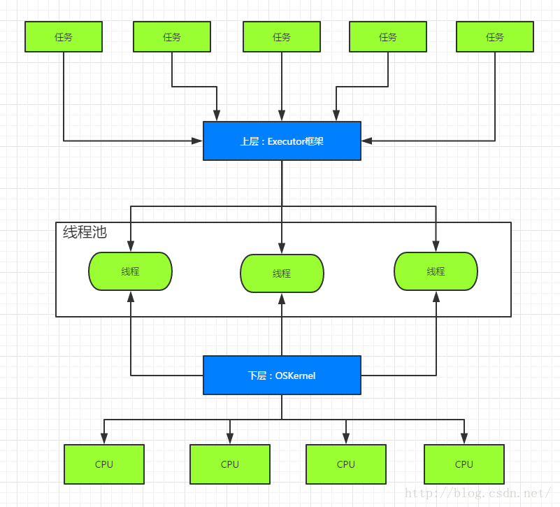
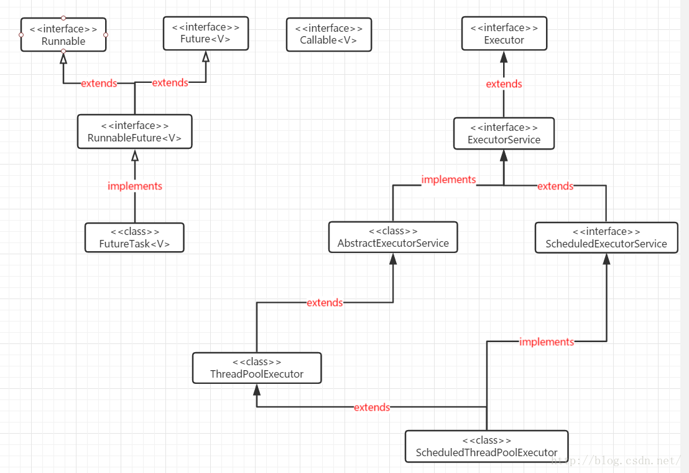
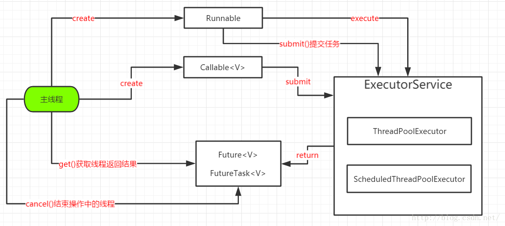
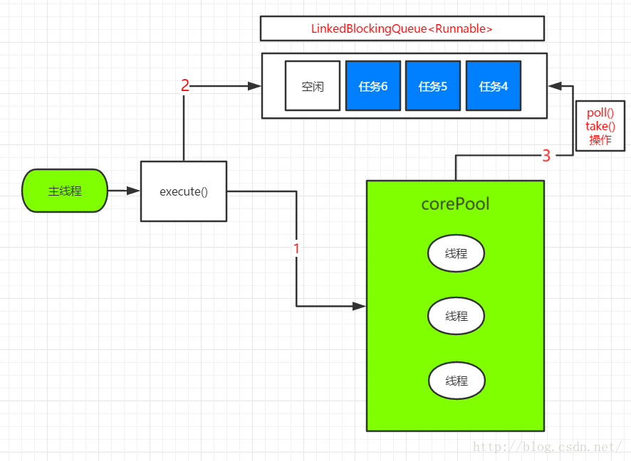
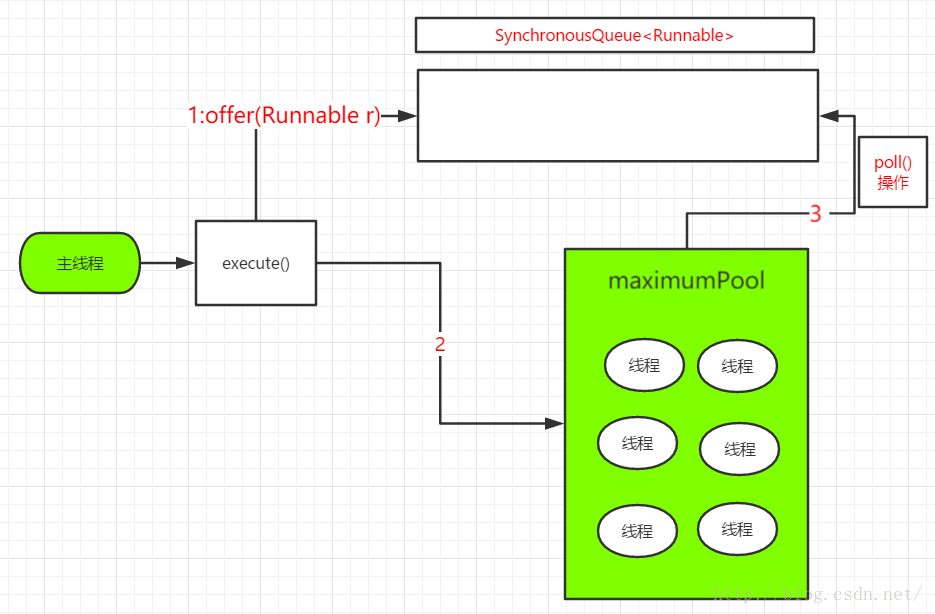
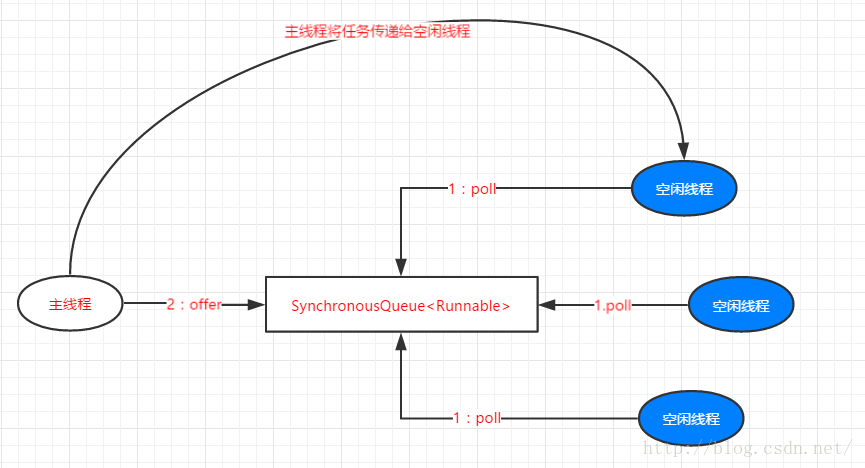
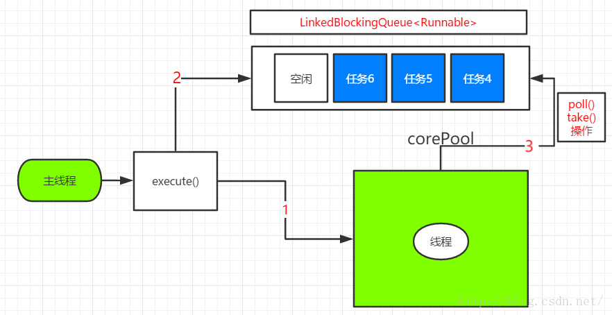
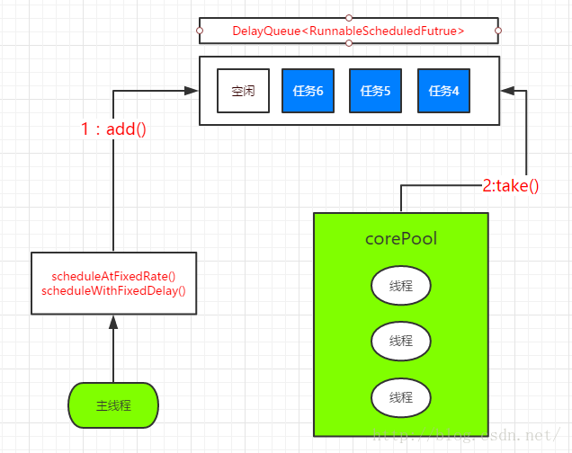

# 线程池Executor框架浅析
## Executor框架
在java中，使用线程来执行异步任务时，线程的创建和销毁需要一定的开销，如果我们为每一个任务创建一个新的线程来执行的话，那么这些线程的创建与销毁将消耗大量的计算资源。同时为每一个任务创建一个新线程来执行，这样的方式可能会使处于高负荷状态的应用最终崩溃。所以线程池的出现为解决这个问题带来曙光。我们将在线程池中创建若干条线程，当有任务需要执行时就从该线程池中获取一条线程来执行任务，如果一时间任务过多，超出线程池的线程数量，那么后面的线程任务就进入一个等待队列进行等待，直到线程池有线程处于空闲时才从等待队列获取要执行的任务进行处理，以此循环.....这样就大大减少了线程创建和销毁的开销，也会缓解我们的应用处于超负荷时的情况。
### Executor框架的两级调度模型
在java线程启动时会创建一个本地操作系统线程，当该java线程终止时，这个操作系统线程也会被回收。而每一个java线程都通过轻量级进程接口被一对一映射为本地操作系统的内核线程（第一篇有说到的1对1线程模型），操作系统会调度所有的线程并将它们分别给可用的CPU。而Executor框架所谓的映射方式是这样实现的，在上层，java多线程程序通过把应用分为若干个任务，然后使用用户级的调度器（Executor框架）将这些任务映射为固定数量的线程；在底层，操作系统内核将这些线程映射到硬件处理器上。这样种两级调度模型如下图所示：

从图中我们可以看出，应用程序通过Executor框架控制上层的调度，而下层的调度由操作系统内核控制，下层的调度不受应用程序的控制。
### Executor框架的结构
Executor框架的结构主要包括3个部分
* 任务：包括被执行任务需要实现的接口：Runnable接口或Callable接口
* 任务的执行：包括任务执行机制的核心接口Executor，以及继承自Executor的EexcutorService接口。Exrcutor有两个关键类实现了ExecutorService接口（ThreadPoolExecutor和ScheduledThreadPoolExecutor）。
* 异步计算的结果：包括接口Future和实现Future接口的FutureTask类（这个我们放在下一篇文章说明）

下面我们通过一个UML图来认识一下这些类间的关系：

Extecutor是一个接口，它是Executor框架的基础，它将任务的提交与任务的执行分离开来。
ThreadPoolExecutor是线程池的核心实现类，用来执行被提交的任务。
ScheduledThreadPoolExecutor是一个实现类，可以在给定的延迟后运行命令，或者定期执行命令。ScheduledThreadPoolExecutor比Timer更灵活，功能更强大。
Future接口和实现Future接口的FutureTask类，代表异步计算的结果。
Runnable接口和Callable接口的实现类，都可以被ThreadPoolExecutor或者ScheduledThreadPoolExecutor执行。区别就是Runnable无法返回执行结果，而Callable可以返回执行结果。
下面我们通过一张图来理解它们间的执行关系：

分析说明：
主线程首先创建实现Runnable或Callable接口的任务对象，工具类Executors可以把一个Runnable对象封装为一个Callable对象,使用如下两种方式：
Executors.callable(Runnable task)或者Executors.callable(Runnable task,Object resule)。
然后可以把Runnable对象直接提交给ExecutorService执行，方法为ExecutorService.execute(Runnable command)；或者也可以把Runnable对象或者Callable对象提交给ExecutorService执行，方法为ExecutorService.submit(Runnable task)或ExecutorService.submit(Callable<T> task)。这里需要注意的是如果执行ExecutorService.submit(...),ExecutorService将返回一个实现Future接口的对象（其实就是FutureTask）。例子如下：
```java
/*author:guaerguagua*/
import java.util.concurrent.*;
public class ExecutorDemos {
    private static class R implements Runnable{
        private Res result;
        public R(Res result){
            this.result = result;
        }
        @Override
        public void run() {
            this.result.msg="执行R任务成功";
            out.println();
        }
    }
    private static class Res {
        public String msg ;
    }
    public static void main(String[] args) {
        Res res = new Res();
        Runnable runnable = new R(res);
        Callable callable = Executors.callable(runnable);
        Callable<Res> callableV = Executors.callable(runnable, res);
        ExecutorService executorService =Executors.newSingleThreadExecutor();
        Future<Res> future=executorService.submit(callableV);
        Future<Res> future1 = executorService.submit(runnable,res);
        Future<Object> future2 = executorService.submit(callable);
        try {
            System.out.println(future.get().msg);//执行R任务成功
            System.out.println(future1.get().msg);//执行R任务成功
            System.out.println(future2.get());//null
        }catch (InterruptedException e){
            e.printStackTrace();
        }catch (ExecutionException e){
            e.printStackTrace();
        }
    }
}
```
当然由于FutureTask实现了Runnable接口，我们也可以直接创建FutureTask，然后提交给ExecutorService执行。到此Executor框架的主要体系结构我们都介绍完了，我们对此有了大概了解后，下面我们就重点聊聊两个主要的线程池实现类。
## ThreadPoolExecutor
ThreadPoolExecutor是线程的真正实现，通常使用工厂类Executors来创建，但它的构造方法提供了一系列参数来配置线程池，下面我们就先介绍ThreadPoolExecutor的构造方法中各个参数的含义。
```java
public ThreadPoolExecutor(int corePoolSize,  
                              int maximumPoolSize,  
                              long keepAliveTime,  
                              TimeUnit unit,  
                              BlockingQueue<Runnable> workQueue,  
                              ThreadFactory threadFactory) {  
        this(corePoolSize, maximumPoolSize, keepAliveTime, unit, workQueue,  
             threadFactory, defaultHandler);  
    }  
```
* corePoolSize：线程池的核心线程数，默认情况下，核心线程数会一直在线程池中存活，即使它们处理闲置状态。如果将ThreadPoolExecutor的allowCoreThreadTimeOut属性设置为true，那么闲置的核心线程在等待新任务到来时会执行超时策略，这个时间间隔由keepAliveTime所指定，当等待时间超过keepAliveTime所指定的时长后，核心线程就会被终止。
* maximumPoolSize：线程池所能容纳的最大线程数量，当活动线程数到达这个数值后，后续的新任务将会被阻塞。
keepAliveTime：非核心线程闲置时的超时时长，超过这个时长，非核心线程就会被回收。当ThreadPoolExecutor的allowCoreThreadTimeOut属性设置为true时，keepAliveTime同样会作用于核心线程。
* unit：用于指定keepAliveTime参数的时间单位，这是一个枚举，常用的有TimeUnit.MILLISECONDS(毫秒)，TimeUnit.SECONDS(秒)以及TimeUnit.MINUTES(分钟)等。
* workQueue：线程池中的任务队列，通过线程池的execute方法提交Runnable对象会存储在这个队列中。
* ThreadFactory：线程工厂，为线程池提供创建新线程的功能。ThreadFactory是一个接口，它只有一个方法：Thread newThread（Runnable r）。

除了上面的参数外还有个不常用的参数，RejectExecutionHandler，这个参数表示当ThreadPoolExecutor已经关闭或者ThreadPoolExecutor已经饱和时（达到了最大线程池大小而且工作队列已经满），execute方法将会调用Handler的rejectExecution方法来通知调用者，默认情况 下是抛出一个RejectExecutionException异常。了解完相关构造函数的参数，我们再来看看ThreadPoolExecutor执行任务时的大致规则：
1. 如果线程池的数量还未达到核心线程的数量，那么会直接启动一个核心线程来执行任务
2. 如果线程池中的线程数量已经达到或者超出核心线程的数量，那么任务会被插入到任务队列中排队等待执行。
3. 如果在步骤2中无法将任务插入到任务队列中，这往往是由于任务队列已满，这个时候如果线程数量未达到线程池规定的最大值，那么会立刻启动一个非核心线程来执行任务
4. 如果在步骤3中线程数量已经达到线程池规定的最大值，那么就会拒绝执行此任务，ThreadPoolExecutor会调用RejectExecutionHandler的rejectExecution方法来通知调用者。

到此ThreadPoolExecutor的详细配置了解完了，ThreadPoolExecutor的执行规则也了解完了，那么接下来我们就来介绍3种常见的线程池，它们都直接或者间接地通过配置ThreadPoolExecutor来实现自己的功能特性，这个3种线程池分别是FixedThreadPool，CachedThreadPool，SingleThreadExecutor。
### FixedThreadPool
FixedThreadPool模式会使用一个优先固定数目的线程来处理若干数目的任务。规定数目的线程处理所有任务，一旦有线程处理完了任务就会被用来处理新的任务(如果有的话)。FixedThreadPool模式下最多的线程数目是一定的。创建FixedThreadPool对象代码如下： 
```java
ExecutorService fixedThreadPool=Executors.newFixedThreadPool(5);  
```
我们来看看FixedThreadPool创建方法源码：
```java
public static ExecutorService newFixedThreadPool(int nThreads) {  
        return new ThreadPoolExecutor(nThreads, nThreads,  
                                      0L, TimeUnit.MILLISECONDS,  
                                      new LinkedBlockingQueue<Runnable>());  
    }  
```
FixedThreadPool的corePoolSize和maximumPoolSize参数都被设置为nThreads。当线程池中的线程数量大于corePoolSize时，keepAliveTime为非核心空闲线程等待新任务的最长时间，超过这个时间后非核心线程将被终止，这里keepAliveTime设置为0L，就说明非核心线程会立即被终止。事实上这里也没有非核心线程创建，因为核心线程数和最大线程数都一样的。下面我们来看看FixedThreadPool的execute()方法的运行流程：

分析：
（1）如果当前运行线程数少corePoolSize，则创建一个新的线程来执行任务。
（2）如果当前线程池的运行线程数等于corePoolSize，那么后面提交的任务将加入LinkedBlockingQueue。
（3）线程在执行完图中的1后，会在循环中反复从LinkedBlockingQueue获取任务来执行。
这里还有点要说明的是FixedThreadPool使用的是无界队列LinkedBlockingQueue作为线程池的工作队列（队列容量为Integer.MAX_VALUE）。使用该队列作为工作队列会对线程池产生如下影响
（1）当前线程池中的线程数量达到corePoolSize后，新的任务将在无界队列中等待。
（2）由于我们使用的是无界队列，所以参数maximumPoolSize和keepAliveTime无效。
（3）由于使用无界队列，运行中的FixedThreadPool不会拒绝任务（当然此时是未执行shutdown和shutdownNow方法），所以不会去调用RejectExecutionHandler的rejectExecution方法抛出异常。
下面我们给出案例，该案例来自java编程思想一书：
```java
public class LiftOff implements Runnable{     
    protected int countDown = 10; //Default     
    private static int taskCount = 0;     
    private final int id = taskCount++;      
    public LiftOff() {}     
    public LiftOff(int countDown) {     
        this.countDown = countDown;     
    }     
    public String status() {     
        return "#" + id + "(" +     
            (countDown > 0 ? countDown : "LiftOff!") + ") ";     
    }     
    @Override     
    public void run() {     
        while(countDown-- > 0) {     
            System.out.print(status());     
            Thread.yield();     
        }     
             
    } 

    public static void main(String[] args) {    
        //三个线程来执行五个任务     
        ExecutorService exec = Executors.newFixedThreadPool(3);        
        for(int i = 0; i < 5; i++) {     
            exec.execute(new LiftOff());     
        }    
        exec.shutdown();     
    }          
}   
```
声明一个Runnable对象，使用FixedThreadPool执行任务结果如下：
```java
#2(9) #0(9) #1(9) #2(8) #0(8) #1(8) #2(7) #0(7) #1(7) #2(6) #0(6) #1(6) #2(5) #0(5) #1(5) #2(4) #0(4) #1(4) #2(3) #0(3) #1(3) #2(2) #0(2) #1(2) #2(1) #0(1) #1(1) #2(LiftOff!) #0(LiftOff!) #1(LiftOff!) #3(9) #4(9) #3(8) #4(8) #3(7) #4(7) #3(6) #4(6) #3(5) #4(5) #3(4) #4(4) #3(3) #4(3) #3(2) #4(2) #3(1) #4(1) #3(LiftOff!) #4(LiftOff!) 
```
### CachedThreadPool 
CachedThreadPool首先会按照需要创建足够多的线程来执行任务(Task)。随着程序执行的过程，有的线程执行完了任务，可以被重新循环使用时，才不再创建新的线程来执行任务。创建方式：
```java
ExecutorService cachedThreadPool=Executors.newCachedThreadPool();   
//工厂方法
public static ExecutorService newCachedThreadPool() {  
        return new ThreadPoolExecutor(0, Integer.MAX_VALUE,  
                                      60L, TimeUnit.SECONDS,  
                                      new SynchronousQueue<Runnable>());  
    } 
```
从该静态方法，我们可以看到CachedThreadPool的corePoolSize被设置为0，而maximumPoolSize被设置Integer.MAX_VALUE，即maximumPoolSize是无界的，而keepAliveTime被设置为60L，单位为妙。也就是空闲线程等待时间最长为60秒，超过该时间将会被终止。而且在这里CachedThreadPool使用的是没有容量的SynchronousQueue作为线程池的工作队列，但其maximumPoolSize是无界的，也就是意味着如果主线程提交任务的速度高于maximumPoolSize中线程处理任务的速度时CachedThreadPool将会不断的创建新的线程，在极端情况下，CachedThreadPool会因为创建过多线程而耗尽CPU和内存资源。
这里需要解释一下SynchronousQueue：
SynchronousQueue与一般的队列不同，它不算一种真正的队列，它没有存储元素的空间，存储一个元素的空间都没有。它的入队操作要等待另一个线程的出队操作，反之亦然。如果没有其他线程在等待从队列中接收元素，put操作就会等待。take操作需要等待其他线程往队列中放元素，如果没有，也会等待。SynchronousQueue适用于两个线程之间直接传递信息、事件或任务。
CachedThreadPool的execute()方法的运行流程：

（1）首先执行SynchronousQueue.offer(Runnable task)，添加一个任务。如果当前CachedThreadPool中有空闲线程正在执行SynchronousQueue.poll(keepAliveTime,TimeUnit.NANOSECONDS),其中NANOSECONDS是毫微秒即十亿分之一秒（就是微秒/1000），那么主线程执行offer操作与空闲线程执行poll操作配对成功，主线程把任务交给空闲线程执行，execute()方法执行完成，否则进入第（2）步。
（2）当CachedThreadPool初始线程数为空时，或者当前没有空闲线程，将没有线程去执行SynchronousQueue.poll(keepAliveTime,TimeUnit.NANOSECONDS)。这样的情况下，步骤（1）将会失败，此时CachedThreadPool会创建一个新的线程来执行任务，execute()方法执行完成。
（3）在步骤（2）中创建的新线程将任务执行完成后，会执行SynchronousQueue.poll(keepAliveTime,TimeUnit.NANOSECONDS)，这个poll操作会让空闲线程最多在SynchronousQueue中等待60秒，如果60秒内主线程提交了一个新任务，那么这个空闲线程将会执行主线程提交的新任务，否则，这个空闲线程将被终止。由于空闲60秒的空闲线程会被终止，因此长时间保持空闲的 CachedThreadPool是不会使用任何资源的。
根据前面的分析我们知道SynchronousQueue是一个没有容量的阻塞队列。每个插入操作必须等到一个线程与之对应。CachedThreadPool使用SynchronousQueue，把主线程的任务传递给空闲线程执行。流程如下：

### SingleThreadExecutor 
SingleThreadExecutor模式只会创建一个线程。它和FixedThreadPool比较类似，不过线程数是一个。如果多个任务被提交给SingleThreadExecutor的话，那么这些任务会被保存在一个队列中，并且会按照任务提交的顺序，一个先执行完成再执行另外一个线程。SingleThreadExecutor模式可以保证只有一个任务会被执行。这种特点可以被用来处理共享资源的问题而不需要考虑同步的问题。
创建方式：
```java
ExecutorService singleThreadExecutor=Executors.newSingleThreadExecutor();

public static ExecutorService newSingleThreadExecutor() {  
        return new FinalizableDelegatedExecutorService  
            (new ThreadPoolExecutor(1, 1,  
                                    0L, TimeUnit.MILLISECONDS,  
                                    new LinkedBlockingQueue<Runnable>()));  
    }  
```
从静态方法可以看出SingleThreadExecutor的corePoolSize和maximumPoolSize被设置为1，其他参数则与FixedThreadPool相同。SingleThreadExecutor使用的工作队列也是无界队列LinkedBlockingQueue。由于SingleThreadExecutor采用无界队列的对线程池的影响与FixedThreadPool一样，这里就不过多描述了。同样的我们先来看看其运行流程：

分析：
（1）如果当前线程数少于corePoolSize即线程池中没有线程运行，则创建一个新的线程来执行任务。
（2）在线程池的线程数量等于corePoolSize时，将任务加入到LinkedBlockingQueue。
（3）线程执行完成（1）中的任务后，会在一个无限循环中反复从LinkedBlockingQueue获取任务来执行。
SingleThreadExecutor使用的案例代码如下：
```java
public class SingleThreadExecutor {     
    public static void main(String[] args) {     
        ExecutorService exec = Executors.newSingleThreadExecutor();     
        for (int i = 0; i < 2; i++) {     
            exec.execute(new LiftOff());     
        }     
    }     
}    
```
### 适用的场景
FixedThreadPool：适用于为了满足资源管理需求，而需要限制当前线程的数量的应用场景，它适用于负载比较重的服务器。
SingleThreadExecutor：适用于需要保证执行顺序地执行各个任务；并且在任意时间点，不会有多个线程是活动的场景。
CachedThreadPool：大小无界的线程池，适用于执行很多的短期异步任务的小程序，或者负载较轻的服务器。
## ScheduleThreadPoolExecutor
### ScheduledThreadPoolExecutor执行机制分析
ScheduledThreadPoolExecutor继承自ThreadPoolExecutor。它主要用来在给定的延迟之后执行任务，或者定期执行任务。ScheduledThreadPoolExecutor的功能与Timer类似，但比Timer更强大，更灵活，Timer对应的是单个后台线程，而ScheduledThreadPoolExecutor可以在构造函数中指定多个对应的后台线程数。接下来我们先来了解一下ScheduledThreadPoolExecutor的运行机制：

先看DelayQueue：
延时阻塞队列DelayQueue是一种特殊的优先级队列，它是无界的，DelayQueue的每个元素都是可比较的，它按元素的延时时间出队，它的特殊之处在于，只有当元素的延时过期之后才能被从队列中拿走，也就是说，take方法总是返回第一个过期的元素，如果没有，则阻塞等待，DelayQueue可以用于实现定时任务。
分析：DelayQueue是一个无界队列，所以ThreadPoolExecutor的maximumPoolSize在ScheduledThreadPoolExecutor中无意义。ScheduledThreadPoolExecutor的执行主要分为以下两个部分
（1）当调用ScheduledThreadPoolExecutor的scheduleAtFixedRate()方法或者scheduleWithFixedDelay()方法时，会向ScheduledThreadPoolExecutor的DelayQueue添加一个实现了RunnableScheduledFuture接口的ScheduleFutureTask。
（2）线程池中的线程从DelayQueue中获取ScheduleFutureTask，然后执行任务。
### 如何创建ScheduledThreadPoolExecutor？
ScheduledThreadPoolExecutor通常使用工厂类Executors来创建，Executors可以创建两种类型的ScheduledThreadPoolExecutor，如下：
（1）ScheduledThreadPoolExecutor：可以执行并行任务也就是多条线程同时执行。
（2）SingleThreadScheduledExecutor：可以执行单条线程。
创建ScheduledThreadPoolExecutor的方法构造如下：
```java
public static ScheduledExecutorService newScheduledThreadPool(int corePoolSize)  
public static ScheduledExecutorService newScheduledThreadPool(int corePoolSize, ThreadFactory threadFactory)  
```
创建SingleThreadScheduledExecutor的方法构造如下：
```java
public static ScheduledExecutorService newSingleThreadScheduledExecutor()  
public static ScheduledExecutorService newSingleThreadScheduledExecutor(ThreadFactory threadFactory)  
```
ScheduledThreadPoolExecutor：适用于多个后台线程执行周期性任务，同时为了满足资源管理的需求而需要限制后台线程数量的应用场景。
SingleThreadScheduledExecutor：适用于需要单个后台线程执行周期任务，同时需要保证任务顺序执行的应用场景。
### ScheduledThreadPoolExecutor使用案例
。。。
